# Dağıtık Sürü İHA Simülasyonu

Bu proje, **TEKNOFEST Sürü İHA Yarışması** kapsamında üç insansız hava aracının aynı görev ortamında koordineli şekilde çalışabilmesi için geliştirildi. Çalışmada temel hedef, tek bir merkezi kontrolcüye bağlı olmayan; her İHA'nın kendi uçuş kontrolünü ve görev kararlarını yerel olarak yürüttüğü **dağıtık bir çok ajanlı yapı** kurmaktı.

Simülasyon altyapısında **PX4 SITL, ROS 2, Gazebo, MAVSDK ve OpenCV** birlikte kullanıldı. Sistem; formasyon uçuşu, joystick ile sürü kontrolü, QR tabanlı görev yürütme, renkli alana otonom iniş, İHA'ya özel görevler ve pitch-roll-yaw manevraları gibi farklı senaryolar üzerinde test edildi.

> Yarışma kapsamında geliştirilen kaynak kodlar public olarak paylaşılmamaktadır. Bu repo, projenin mimarisini, çalışma mantığını ve simülasyon çıktılarının nasıl elde edildiğini göstermek amacıyla hazırlanmıştır.

  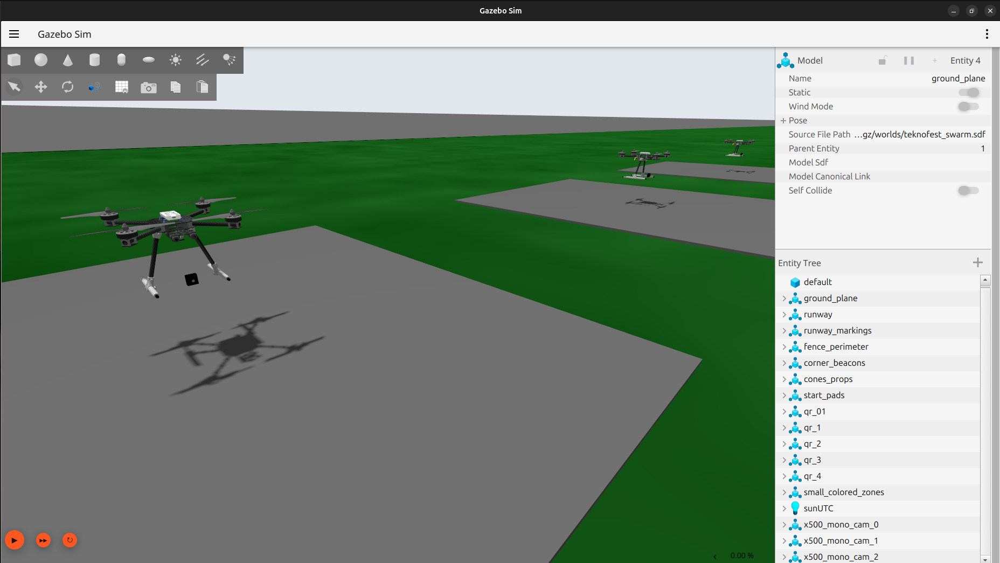

  <em>Gazebo simülasyon ortamında kullanılan üç İHA.</em>

  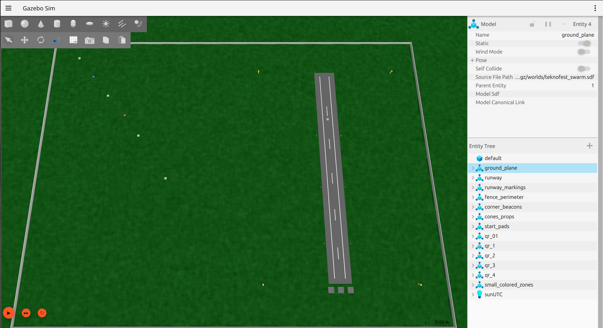

  <em>QR görev noktaları ve iniş bölgelerini içeren Gazebo simülasyon ortamı.</em>

---

## Sistem Yaklaşımı

Sistemde üç İHA da ayrı birer ajan olarak çalışır. Her aracın kendi **Python kontrol süreci, ROS 2 node'u, MAVSDK bağlantısı, PX4 SITL instance'ı ve telemetri akışı** bulunur. Ajanlar gerekli görev ve durum bilgilerini ROS 2 üzerinden paylaşır; ancak her İHA kendi setpoint'ini ve kontrol düzeltmelerini kendi sürecinde hesaplar.

Bu nedenle yapı klasik bir lider-takipçi sistemi olarak tasarlanmadı. Bazı senaryolarda joystick, kamera veya QR verisi tek bir giriş noktasından sisteme alınsa da diğer araçların düşük seviyeli uçuş kontrolü merkezi olarak hesaplanmaz.

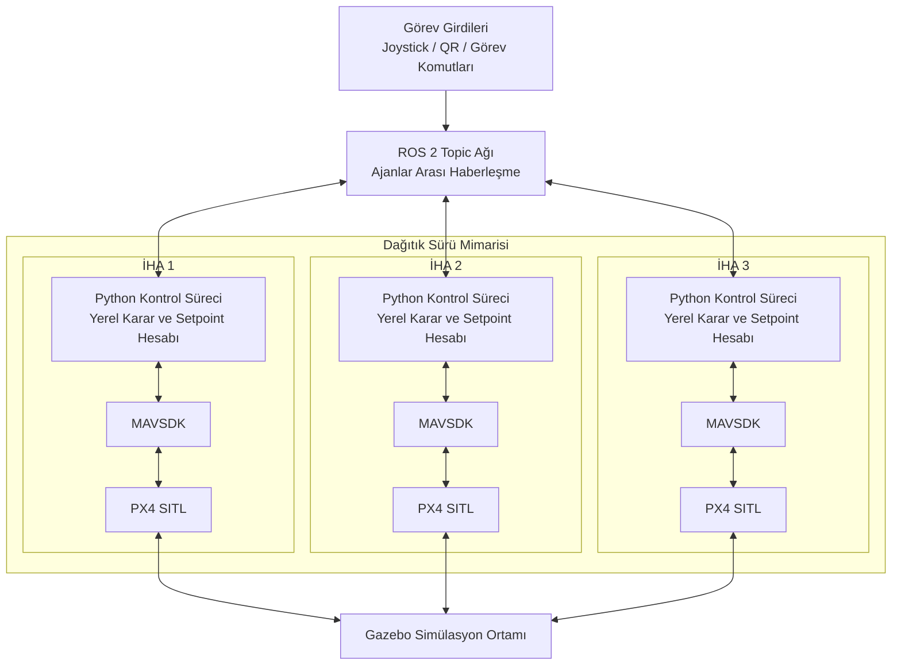

  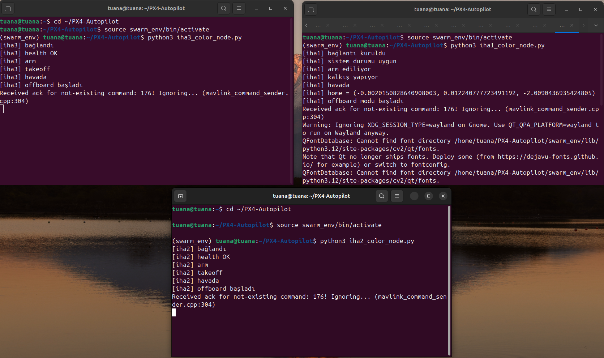
  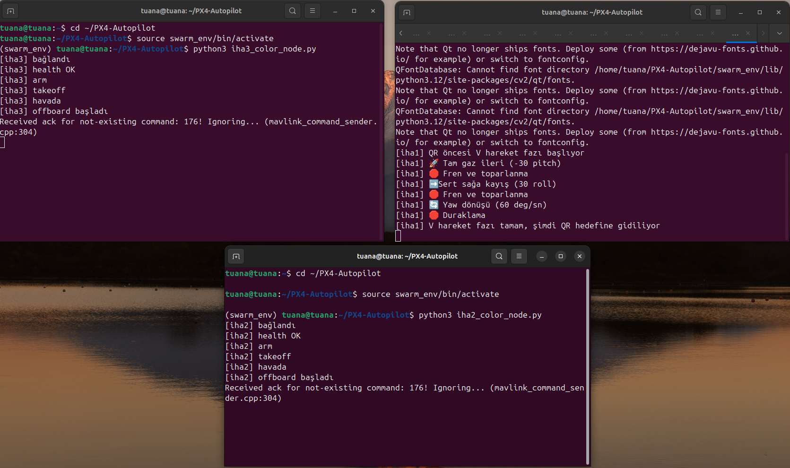

  <em>Her İHA'nın bağımsız süreç ve kontrol yapısı üzerinden çalıştırılması.</em>

---

## Formasyon Kontrolü

Üç İHA için **V, Line ve Arrow** formasyonları oluşturuldu. Her ajan formasyondaki kendi göreli konumunu bilir ve hedefini buna göre hesaplar. Sürü yön değiştirdiğinde sabit offset değerlerinin dünya ekseninde yanlış kalmaması için formasyon geometrisi yaw açısına göre döndürülür.

Bu sayede formasyon yalnızca sabit bir yönde değil, manevra sırasında da korunabilir. Araçların anlık konum ve hız hataları kullanılarak yerel düzeltmeler uygulanır; aşırı düzeltmeler ise sınırlandırılır. İHA'lar birbirine fazla yaklaştığında mesafeye bağlı ek bir kaçınma düzeltmesi devreye girer.

Formasyon performansı yalnızca görsel olarak değerlendirilmedi. Uçuş sırasında kaydedilen konum verileri kullanılarak araçlar arası mesafe değişimleri, maksimum sapma ve RMSE değerleri de analiz edildi.

  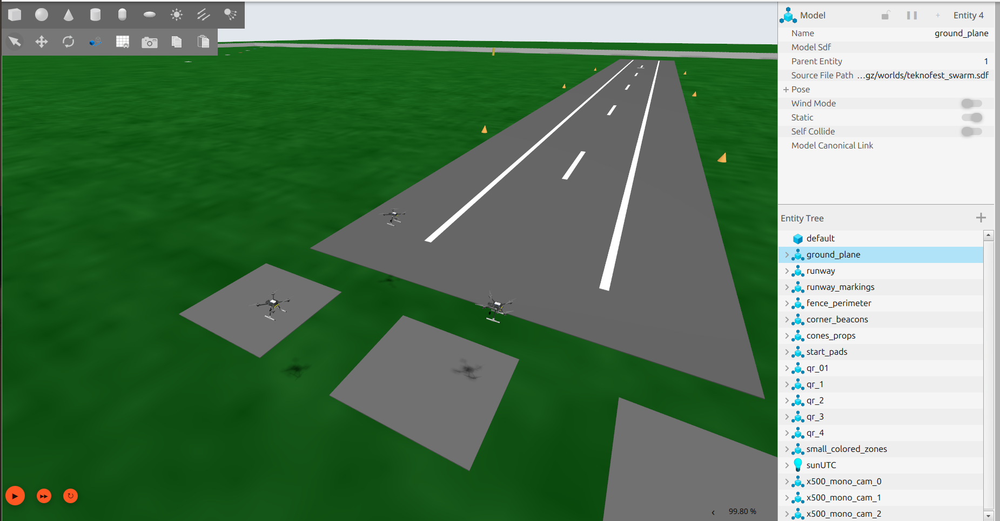
  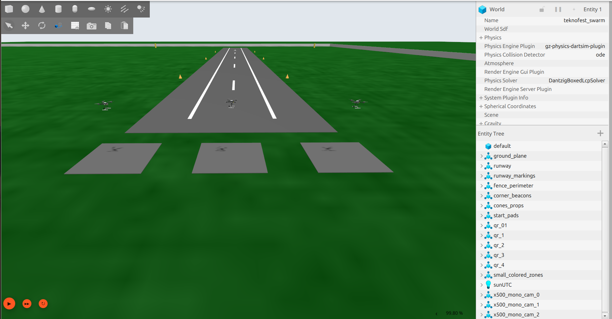
  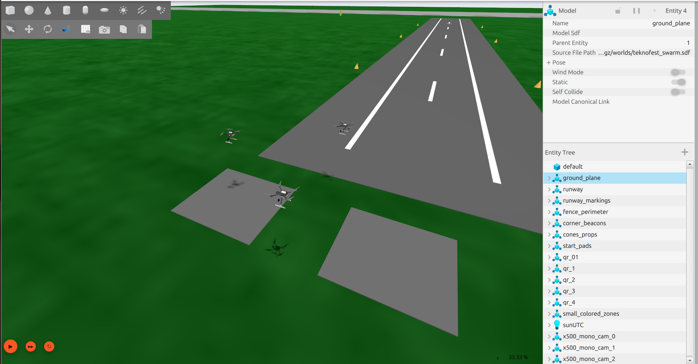

  <em>Simülasyon ortamında uygulanan V, Line ve Arrow sürü formasyonları.</em>

---

## Joystick ile Sürü Kontrolü

Otonom görevlerden bağımsız olarak manuel bir sürü kontrol modu geliştirildi. Joystick eksenlerinden alınan ileri-geri, sağ-sol, yükselme-alçalma ve yaw komutları ROS 2 üzerinden işlenerek sürü hareketine dönüştürüldü.

Joystick girdileri doğrudan dünya koordinatına uygulanmadı. Aracın mevcut yaw açısı hesaba katılarak gövde eksenindeki hareket komutu NED koordinat sistemine dönüştürüldü. Böylece operatörün verdiği **“ileri”** komutu, araç yön değiştirmiş olsa bile aracın baktığı doğrultuda ileri hareket anlamını korudu.

Bu modda üç araç ayrı süreçlerde çalışmaya devam ederken ortak hareket referansı üzerinden formasyon geometrisini koruyacak şekilde kendi hedeflerini üretir.

---

## QR Tabanlı Otonom Görev Akışı

Görev sahasına yerleştirilen QR kodlar Gazebo'daki kamera görüntüsü üzerinden okunur. Görüntü ROS 2 aracılığıyla alınır, NumPy/OpenCV formatına çevrilir ve **OpenCV `QRCodeDetector`** ile decode edilir.

  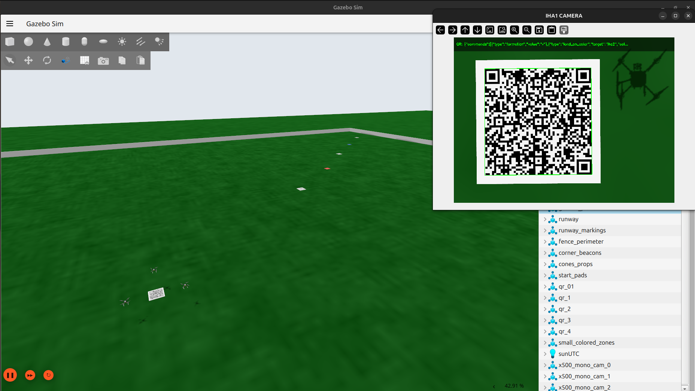

  <em>Gazebo kamera görüntüsü üzerinden gerçekleştirilen QR algılama işlemi.</em>

QR içerisinde doğrudan uçuş kontrol sinyalleri yerine yüksek seviyeli görev tanımları bulunur. Okunan veri görev yönetim katmanında yorumlanarak sürü davranışına dönüştürülür. Bu yapı sayesinde aynı görev akışı içinde;

- formasyon değiştirme,
- yeni bir koordinata ilerleme,
- belirli süre bekleme,
- yalnızca belirli bir İHA'ya görev verme,
- tek bir İHA'nın irtifasını değiştirme,
- renkli alana iniş,
- sürüye yeniden katılma,
- ortak irtifaya dönme,
- eve dönüş

gibi farklı görevler yürütülebilir.

  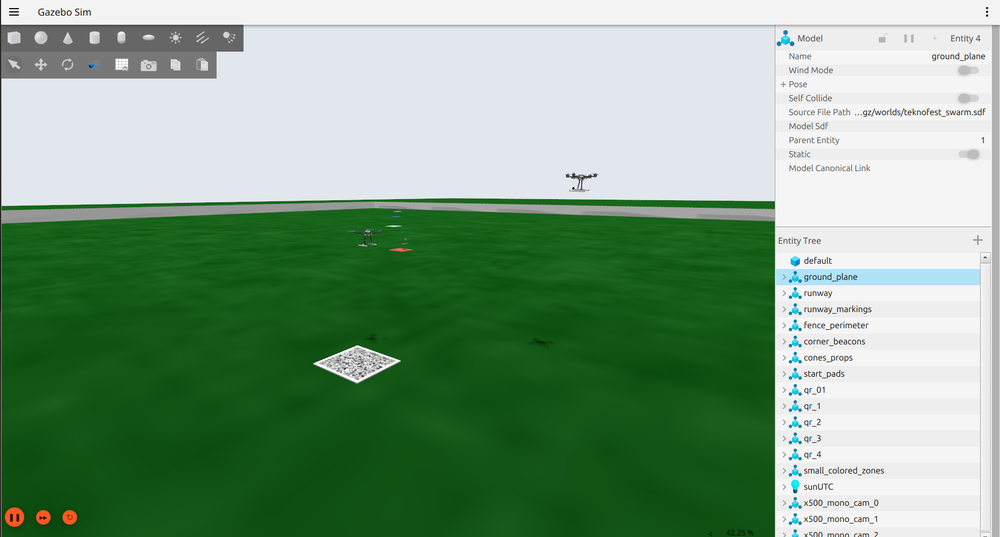

  <em>QR içerisinden alınan görev bilgisinin sürü tarafından uygulanması.</em>

Aynı QR'ın kamera görüntüsünde uzun süre kalması durumunda görevin tekrar tekrar tetiklenmesini önlemek için daha önce okunan QR'lar kayıt altında tutulur.

---

## Görüntü İşleme ve Renkli Alana Otonom İniş

Renkli iniş alanlarının tespiti için OpenCV tabanlı bir görüntü işleme hattı geliştirildi. Kamera görüntüsü HSV renk uzayına çevrilerek kırmızı ve mavi bölgeler ayrıştırıldı. Gürültüyü azaltmak için morfolojik işlemler uygulandı ve geçerli hedef en büyük kontur üzerinden belirlendi.

Tespit edilen alanın merkezi ile kamera görüntüsünün merkezi arasındaki fark, İHA için küçük konum düzeltmelerine çevrildi. Araç hedefin üzerine yeterince hizalandığında ve alan görüntüde belirli bir büyüklüğe ulaştığında kontrollü alçalma başlatıldı.

  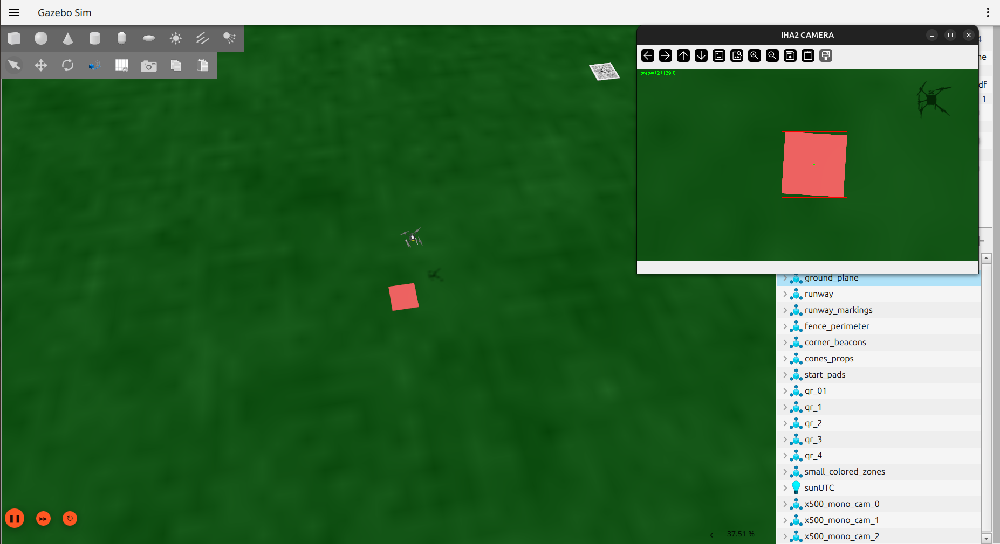

  <em>Renkli iniş bölgesine görsel geri besleme ile gerçekleştirilen otonom yaklaşma ve iniş.</em>

Hedef kısa süreli kaybolduğunda görev doğrudan sonlandırılmadı. Son görülen konum korunarak sınırlı bir yeniden arama davranışı uygulandı. Görev tamamlandıktan sonra ilgili İHA'nın tekrar kalkıp sürü formasyonuna katılabileceği bir **rejoin** akışı da oluşturuldu.

---

## İHA'ya Özel Görevler

Sistemde bütün araçların aynı komutu uygulaması zorunlu değildir. Görev mesajları belirli bir ajana hedeflenebilir. Örneğin sürü formasyon halinde hareket etmeye devam ederken yalnızca bir İHA farklı irtifaya çıkabilir veya renkli alana iniş görevi alabilir.

Bu yaklaşım, sürü görevlerinin tek parça bir hareket olarak değil; gerektiğinde ajan bazında ayrıştırılabilen bir görev yapısı olarak ele alınmasını sağladı.

---

## Pitch, Roll ve Yaw Manevraları

Sürünün yalnızca konum tabanlı hareketini değil, attitude davranışını da test etmek amacıyla ayrı bir manevra senaryosu geliştirildi. Üç İHA üzerinde pitch, roll ve yaw komutları uygulanırken formasyon bozulmasının azaltılması için her ajan kendi konum ve hız hatasına göre düzeltme hesapladı.

XY düzleminde konum ve hız hatalarından yararlanan geri besleme uygulanırken, irtifa tarafında thrust değeri dikey konum ve hız geri beslemesiyle ayarlandı. Böylece attitude manevrası sırasında oluşan yatay ve dikey sapmaların sınırlandırılması amaçlandı.

---

## Simülasyon Ortamı

Görevlerin aynı ortamda tekrar tekrar test edilebilmesi için özel bir Gazebo sahası hazırlandı. Sahada üç İHA, QR görev noktaları, kırmızı ve mavi iniş bölgeleri, pist ve görev alanı sınırları birlikte kullanıldı.

PX4 SITL sayesinde her araç gerçek uçuş kontrol yazılımını simülasyon üzerinde çalıştırırken, MAVSDK üzerinden arm, takeoff, land, Offboard ve attitude komutları gönderildi. ROS 2 ise ajanlar ve görev modülleri arasındaki veri paylaşımını sağladı.

---

## Kullanılan Teknolojiler

**Python · ROS 2 Jazzy · PX4 SITL · Gazebo · MAVSDK / MAVLink · OpenCV · NumPy · Pandas · Matplotlib**

---

## Projede Üzerinde Çalıştığım Başlıca Konular

- Dağıtık çoklu İHA kontrol mimarisi
- ROS 2 tabanlı ajanlar arası haberleşme
- PX4 SITL ve MAVSDK entegrasyonu
- Formasyon oluşturma ve manevra sırasında formasyon korunumu
- Joystick tabanlı sürü kontrolü
- QR tabanlı otonom görev yönetimi
- OpenCV ile renk algılama ve görsel geri beslemeli iniş
- İHA'ya özel görev dağıtımı ve sürüye yeniden katılma
- Pitch, roll ve yaw manevra testleri
- Telemetri kaydı ve formasyon hata analizi
- Gazebo görev ortamının hazırlanması ve sistem testleri

---

## Kaynak Kod Hakkında

Projenin tam kaynak kodu yarışma kapsamında geliştirildiği için bu public repository'de paylaşılmamaktadır. Buradaki içerik; geliştirilen sistemin teknik yaklaşımını, kullanılan yöntemleri ve simülasyon sonuçlarını portföy amaçlı göstermek için hazırlanmıştır.
